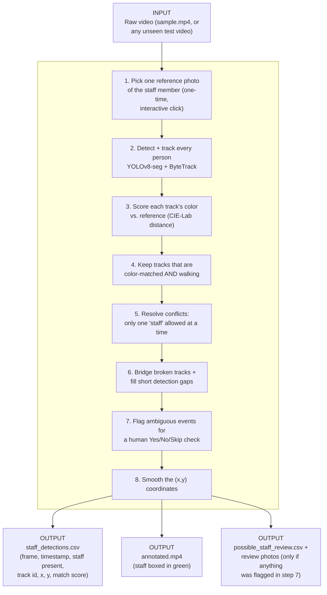

# FootfallCam AI Engineer Assessment — Staff Identification & Localization

## 1. Executive Summary

- **Name:** ENG YI SIANG
- **Project:** Staff Identification & Localization from an Overhead CCTV Video
- **Repo:** https://github.com/yisiangeng/yisiang_footfallcam_ai_eng_assessment
- **Solution:** detect and track every person (YOLOv8-seg + ByteTrack), match each track's clothing color to one human-picked reference photo (CIE-Lab distance), keep only tracks that are both color-matched and genuinely walking, auto-resolve conflicts and stitch broken tracks, and ask a human to confirm any case it can't decide on its own rather than guess.

## 2. Assumptions

- A human picks one reference photo of the staff member up front; the system propagates that example, it never reads the tag or discovers "who is staff" on its own.
- Exactly one person is genuinely staff at a time (per the brief) — enforced: if two tracks both match at once, only the stronger one is kept.
- Only a **walking** person counts as staff — a seated color match is too ambiguous (several people dress alike), while a walking match was the one visually unambiguous case. A staff member who sits for long stretches would be missed.
- Clothing color is a proxy for identity, since the tag itself isn't resolvable at this resolution (confirmed by zooming into the reference crop — no logo is visible, just a color blob). This is the ceiling the whole approach operates under.
- A tracker ID is trusted as one continuous person unless its position or color jumps sharply — a slow, quiet ID-switch would go undetected.
- A short, nearby gap between two sightings is treated as the same person continuing, not a different one ("a person doesn't teleport") — reasonable here, weaker in a dense crowd.
- One reference photo represents the staff's look for as long as their outfit doesn't change. Which frame gets picked matters a lot in practice (see §6) — a distinctive color is safer than a generic dark one.
- The camera is static (no pan/zoom) — motion is measured in raw pixel coordinates.
- An unseen test video is assumed to have similar camera geometry to `sample.mp4`; all tuned constants are specific to this footage and re-checked (not blindly trusted) via a diagnostic table the tool prints each run.
- No labeled training data exists beyond `sample.mp4` — every model used is pretrained and unmodified.

## 3. Methodology & Pipeline

- **Input:** one video file, nothing pre-processed — the same script runs unmodified on `sample.mp4` or a new, unseen test video.
- **Pipeline:** steps 1-8 above, all in a single pass over the video (step 1 is the only manual input; steps 2-8 run automatically).
- **Output:** a per-frame location table (the bonus task), a visual video for a quick sanity check, and — only when something was genuinely ambiguous — an audit trail of what was flagged and how it was resolved.

**Models used, and why:**
- **YOLOv8-seg (COCO-pretrained)** — detects + segments every person; masks let non-person pixels (desk, floor) be blanked before color is measured, fixing the biggest early source of false positives.
- **ByteTrack** — links detections into per-person tracks, replacing a naive centroid tracker whose IDs swapped when people crossed paths.
- **CIE-Lab color distance** — the primary identity signal; classical, not learned. Cleanly separates the true match (~20-30 distance) from everyone else (~60-100+).
- **Motion-based track filter (velocity + displacement thresholding)** — a color match only counts if the track's own speed/range also indicates real walking, not a seated match.
- **Human-in-the-loop review** — an unclear walking track (e.g. after an outfit change) is shown to a person as a Yes/No/Skip prompt instead of auto-labeled (deliberate — see §6).

**Models tried and rejected:**
- **HSV histograms** — couldn't separate dark clothing from the low-saturation floor background.
- **CLIP embeddings as primary matcher** — anti-correlated with the true match (genuine staff scored lowest); likely doesn't transfer from eye-level pretraining to this top-down view. Kept only as an optional flag.
- **Logo/tag template matching** — no logo is resolvable at this resolution at all (confirmed by zooming in); ruled out entirely.
- **A trained staff/not-staff classifier** — no labeled dataset exists to train one.
- **Motion-only (background-subtraction) detection** — high recall, poor precision, loose boxes that dilute color reads; superseded by YOLO, kept only as a lightweight fallback.

## 4. Results

Ground truth: true staff-visible windows reported by a human watching `sample.mp4` (12s-23s, 31s-50s), diffed against the pipeline's output.

| Metric set | Precision | Recall | F1 | Notes |
|---|---|---|---|---|
| Naive frame-presence (baseline) | 1.000 | 0.365 | 0.534 | Zero false positives; recall limited by tracking fragmentation |
| Identity-aware (baseline) | 0.920 | 0.336 | 0.492 | Discounts ~22 frames where a mid-contact ID-switch briefly misattributed the box |
| After bridging + position-jump fixes | 1.000 | 0.448 | 0.619 | Recall improved, precision still perfect |

- Precision stays perfect throughout: the failure mode is missing real staff frames, not false alarms.
- IoU wasn't computed for localization — no pixel-level ground truth exists. Accuracy was checked qualitatively by re-watching the annotated video, which is how the ID-switch above was actually caught.
- Coordinate smoothing (Savitzky-Golay) was visually verified: removes small jitter with no visible lag, on a light ~5-frame window.

## 5. Steps to Use

1. Copy the test video into this project's folder.
2. Open a terminal in this folder.
3. Run: `.venv\Scripts\python.exe src\staff_id.py`
4. Pick the video from the list it shows.
5. A window pops up — scrub to a clear view of the staff member, drag a box around them, press Enter. (Only manual step; tells the program who to look for.)
6. Wait a few minutes while it processes automatically.
7. If it's unsure about someone (e.g. an outfit change), a photo pops up asking "Is this the staff member? (Y/N/Skip)" — answer with one keypress.
8. Check the output folder: `annotated.mp4` shows the result at a glance (staff boxed in green); `staff_detections.csv` has per-frame (x, y) data.

## 6. Challenges, Solutions & Limitations

| # | Challenge | Solution |
|---|---|---|
| 1 | A quick single-frame test wrongly suggested YOLO couldn't detect people from this angle | Re-tested across 65 frames — 100% detected; first frame was just an outlier |
| 2 | Loose detection boxes included background pixels, diluting the color match | Restricted color sampling to actual person pixels via segmentation mask |
| 3 | CLIP scored the real staff member lowest of all tracks — backwards | Dropped as primary signal; kept classical Lab distance, which separates cleanly |
| 4 | Several people dress alike; some just sit still and coincidentally match on color | Only a genuinely *walking* track can count as staff |
| 5 | Staff changes from shirt to jacket mid-video, breaking the fixed reference; tag too small to read | Flag ambiguous cases for a one-click human Yes/No instead of guessing |
| 6 | Tracker kept losing/re-finding the same person, fragmenting one walk into short, uncounted pieces — the biggest cause of missed frames | Stitch nearby fragments and fill short gaps, on a "person doesn't teleport" rule |
| 7 | During brief contact between two people, the tracker quietly handed identity to the wrong person for ~1s | Flag sub-events with a physically implausible position jump for separate review |
| 8 | Two people could both score "staff" at once, which the brief says is impossible | Auto-keep the higher-scoring track; log and discard the other |
| 9 | A reviewer once answered wrong because a confirmation photo was too tight to judge by | Show two wider, highlighted photos per event, plus the reason it was flagged |
| 10 | A generic dark reference photo made the real staff score lower than random bystanders | Added on-screen guidance to pick the most distinctive frame/outfit |

**Known limitations:**
- Not a from-scratch identification system — propagates one human-picked example; can't recognize the tag itself.
- A same-colored, gradual ID-switch with no position jump would not be caught.
- A similarly-dressed non-staff person walking alone (not simultaneously with real staff) could still be misclassified.
- All tuning constants are calibrated on `sample.mp4` and need re-checking (via the printed diagnostic table) on any new video.
- The fragmentation fix is a partial, measured improvement (+8 recall points), not a full fix.
